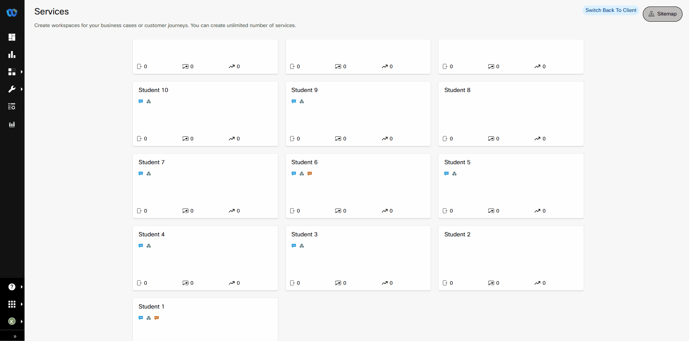
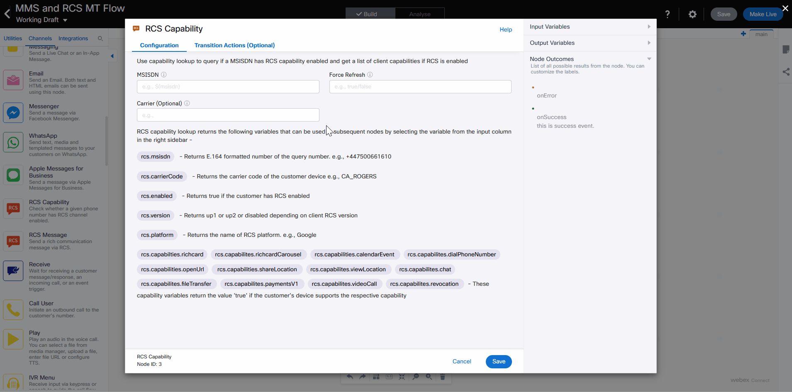

In this exercise you will be building a new flow which will check if a mobile phone capable of RCS messaging.  If the device and carrier are enabled for RCS, a new RCS message will be sent to the number, if the device is not enabled, it will failover to sending an MMS message.

## Create a new webhook flow
In your Service: Student <w class="pod"></w>  
> Click View My Flows  
> Click the Create Flow button  
>> Flow Name: <copy>MMS and RCS MT Flow</copy>  
>> Method: New Flow  
>> Select: Start from Scratch 
> 
> Click the Create button  
> ??? gif "Show Me"
    
> On the Select Trigger Category screen:  
>> Click Webhook 
> 
> ---


<!--  -->


## Configuring the Webhook
> Select: Create new event  
> Name: <copy>Wx1_26_Student_<w class="POD"></w></copy>  
> In the **PROVIDE SAMPLE INPUT** area paste the following JSON:
!!! code w50 "&nbsp;"
    ```json
    {
    "phone": "15615551212",
    "msg": "Here is my message to be delivered"
    }
    ```
> Press the **Parse** button (you may need to scroll down in the window depending on your screen resolution)  
> Paste the webhook URL in the text box below
>    <form id="info">
>  <label for="hookURL">Webhook URL:</label>
    <input type="text" size="60" id="hookURL"  name="hookURL" onChange="setItem(this.id, this.value)"><br>
    </form>
> Click Save  
> ---

## Check for RCS Capability  
> Drag an RCS Capability node onto the canvas  
> Connect the output node edge of the Configure webhook node to the input node edge of the RCS Capability node  
> Double click the new node to configure it 
> Click into the MSISDN textbox  
> In the Input Variables section of the left pane, click the Start node to expand the variables list  
> Click the variable **inboundWebhook.phone**  
> The MSISDN textbox should now be populated with the variable path  
> Click Save  
> ??? gif "Show Me"
    
> ---

## Add a Branch node to handle the logic for RCS vs. MMS
> Drag a Branch node onto the canvas  
> Connect the green onSuccess output node edge of the RCS Capability node to the input node edge of the Branch node  
> Double click the new node to configure it 
> Click in the **Variable** text box  
> In the Input Variables section of the left pane, click the RCS Capability node to expand the variables list  
> Click the variable **rcs.enabled** to populate the variable path  
> In the Condition dropdown, select: Equals  
> In the Value textbox enter the text: <copy>true</copy>  
> Click Save  
> ---

## Add an RCS Message node
> Drag a an RCS Message node onto the canvas  
> Connect the green output node edge of the Branch node to the input node edge of the RCS Message node  
> When prompted, select **Branch1**  
> Double click the new node to configure it   
> > Destination: Add the variable path for **inboundWebhook.phone**  
> > Message Type: Rich Card  
> > Media URL: <copy>https://qaemailmedia.s3.amazonaws.com/2dfadf61-9978-47dd-8a54-766f69c7e6d6/Your-Kittens-First-Year-Header_145741850115578.png</copy>  
> > Thumbnail URL: <copy>https://qaemailmedia.s3.amazonaws.com/2dfadf61-9978-47dd-8a54-766f69c7e6d6/Your-Kittens-First-Year-Header_145741850115578.png</copy>  
> > Title: <copy>Welcome to the lab!</copy>  
> > Description: Add the variable path for **inboundWebhook.msg**  
> > While still in the textbox for Description, add a space and then backspace to delete it.  
>
> Click Save  
> 
> ---

## Add an MMS node
> Drag a an RCS Message node onto the canvas  
> Connect the green output node edge of the Branch node to the input node edge of the MMS node  
> When prompted, select **None of the above**  
> Double click the new node to configure it 
> > Destination: Add the variable path for **inboundWebhook.phone**  
> > While still in the textbox for message configuration add a space and then backspace to delete it.   
> > From Number: +16693323847  
>>  MMS Message Subject: <copy>RCS not enabled for this device</copy>  
> > Media Type: Image  
>>  Media URL: <copy>https://qaemailmedia.s3.amazonaws.com/2dfadf61-9978-47dd-8a54-766f69c7e6d6/sadKitty_239352025917078.jpg</copy>  
> > Message: Add the variable path for **inboundWebhook.msg**  
> > While still in the textbox for message, add a space and then backspace to delete it.  
>
> Click Save  
> 
> ---

## Save and Publish the Flow
> In the upper right corner of the Flow Builder, click Save
> You can ignore the errors for now, we have not included error handling yet.  
> Click Make Live and Select the Application **CommsAPI**
> It will take a few minutes to publish
>
> ---

## Time to Test
> Enter your Mobile number and a test message into the form below, then click the Send Test button  
>> You should either receive an MMS message or an RCS message depending on what your device + carrier support.  

<form id="testing" onsubmit="sendTest(event)">
    <label for="phone">Phone Number:</label>
    <input type="tel" id="phone" name="phone" required><br>

    <label for="message">Message:</label>
    <input type="text" id="message" name="message" required><br>
    <button type="submit">Send Test</button>
    <output role="status" aria-live="polite"></output>
    </form>
