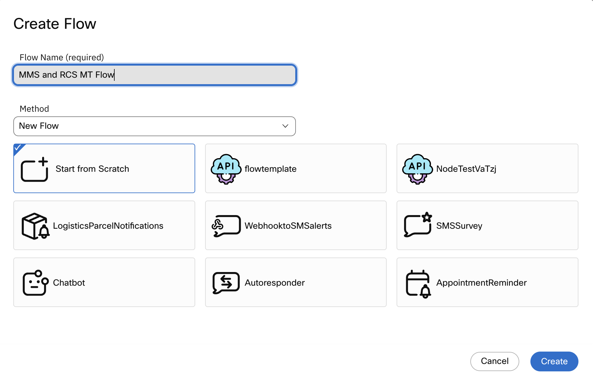
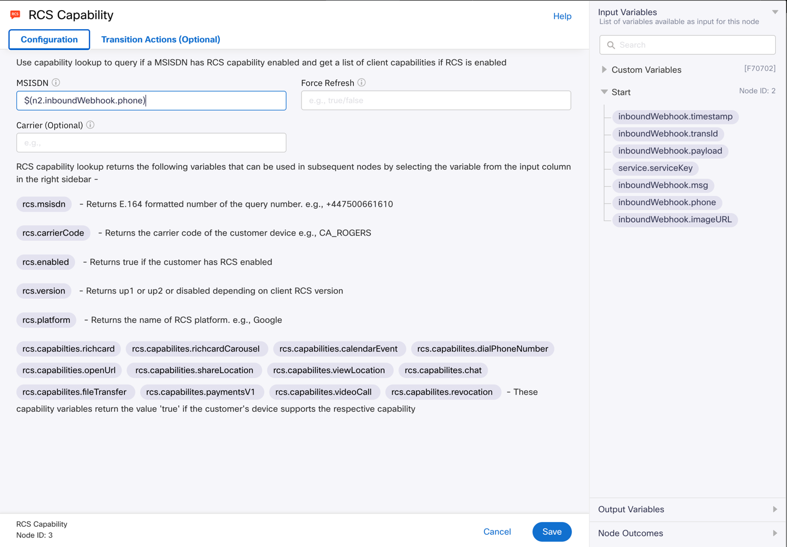
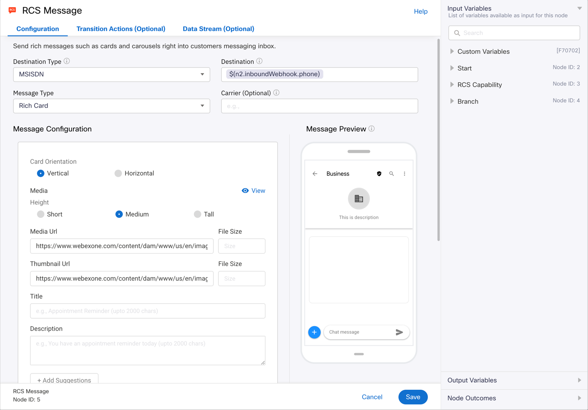
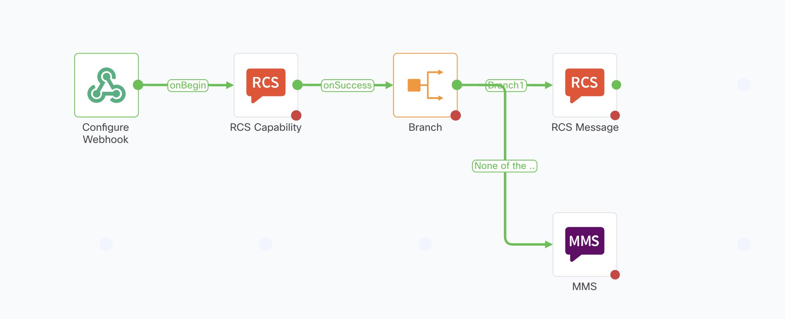

# Lab 1 MMS/RCS Flow

The final lab today is an MMS/RCS flow. The flow will send out a simple MMS or RCS message depending on the capability of the end user phone.

Start the flow off by Clicking “Create Flow” in your Service

Configure the flow as follows:
!!! frame w75 ""
    

Click “Create”

When the Trigger Page displays choose “Webhook” under the “Custom” section.
!!! frame w75 ""
    

When the Flow Canvas comes up, double click the Webhook Trigger Node to open it and configure it as follows:

Create New Event {Select this option}

Paste the payload below into the “Provide Sample Input” area.
!!! code w75 "&nbsp;"
    ```json
    {
    "phone": "15615551212",
    "imageURL": "http://mywebsite.com/image.jpg",
    "msg": "Here is my message to be delivered"
    }
    ```

Click “Parse” to parse the variables from the payload.
!!! frame w75 ""
    

The next step is to drag and drop an RCS Capability node from the Node Pallet to the right of the Trigger node.

Double click the RCS Capability node to open it and configure it as follows:

MSISDN: {Expand the “Start” variables on the right and making sure the cursor is in the MSISDN field click “inboundwebhook.phone”}

You can leave the rest of the fields blank.

Click “Save”
!!! frame w75 ""
    

Click “Save”

Next drag a “Branch” node from the Node Pallet to the right of the Capability Check and connect it.

Double click the Branch node to open it and configure it as follows:

For Branch 1

Variable: {Expand the RCS Capabilities Variables on the right side, then click “rcs.enabled”}

Condition: {Drop down menu to “Equals”}

Value: true (make sure it is lower case)

Click “Save”

Drag the RCS Message node from the Node Pallet to the right of the Branch node and connect them, using the Branch1 Event, double click the RCS Message node to open it and configure it as follows:

Destination Type: MSISDN

Destination: {Expand the “Start” variables on the right side and click “inboundWebhook.phone”}

Message Type: Rich Card

Carrier: Leave Blank

Message Configuration: {Use the link below for the thumbnail and image URLs}

Card Orientation: Vertical

Media: Medium

Media URL and Thumbnail URL: {Use the link below}

https://www.webexone.com/content/dam/www/us/en/images/webexone/2025/wx1-white-new.svg

Description: {Go back to the Start variables on the right and click “inboundWebhook.msg”}

Leave the rest as the default

Click “Save”
!!! frame w75 ""
    

For phones that do not have RCS enabled, we will want to get the image delivered so we will add an MMS node.

Drag an MMS node from the Node Pallet to under the RCS Message node and connect the Branch node to the MMS node. The connector will default to “None of the Above”, double click to open the MMS Node and configure as follows:
!!! frame w75 ""
    

Destination Type: msisdn

Destination: {On the right, expand the Start variables and click on “inboundWebhook.phone”}

MMS Subject: Leave Blank

Media Type: Image

Media URL: https://www.webexone.com/content/dam/www/us/en/images/webexone/2025/wx1-white-new.svg

Message: {Go back to the Start variables and click on “inboundWebhook.msg”}

Leave the rest of the parameters as default

Click “Save”
