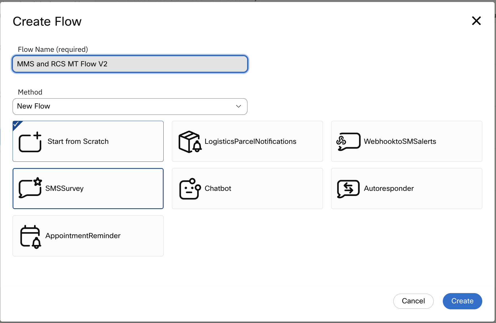
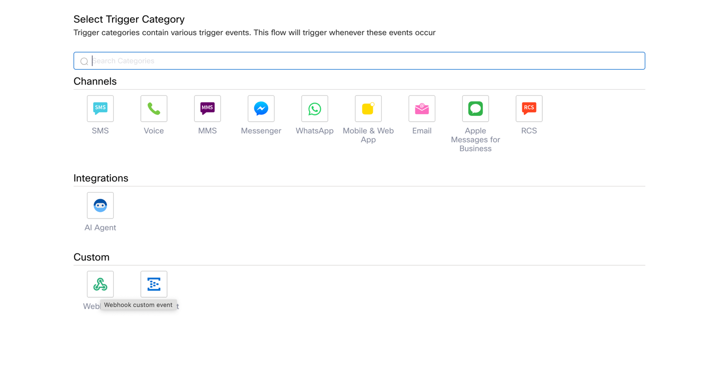
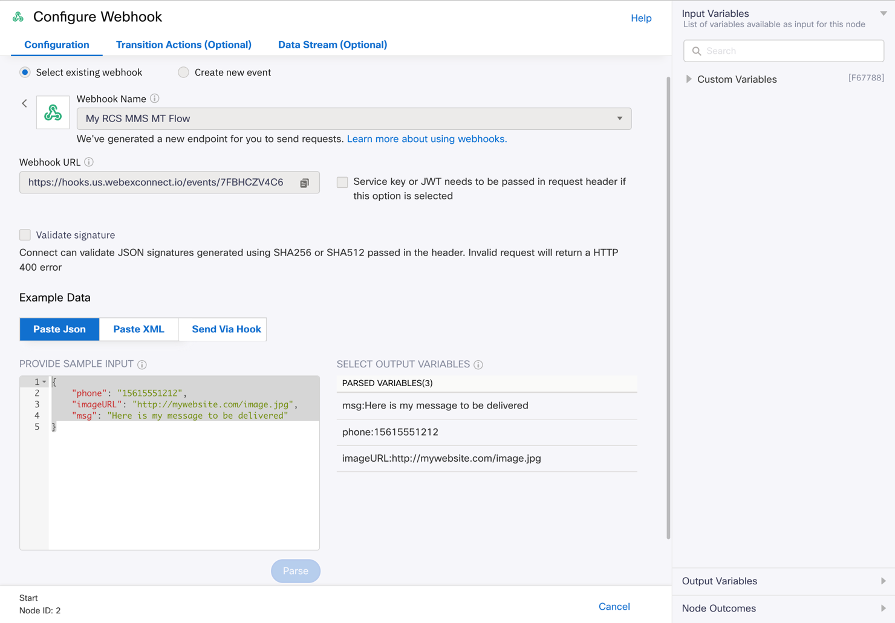
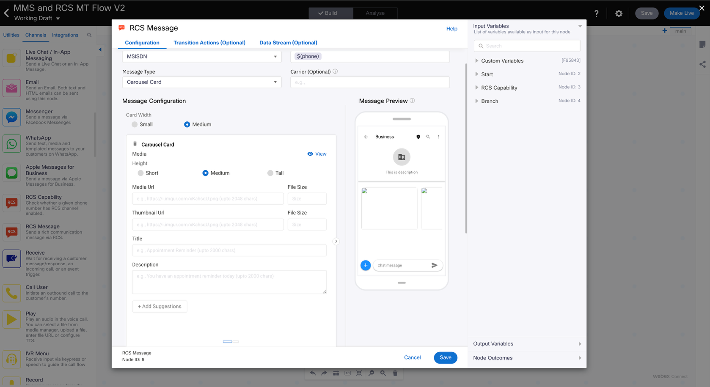

# Lab 2 RCS Carousel

We start this lab the same way as we did the previous one.

Start the flow off by Clicking “Create Flow” in your Service

Configure the flow as follows except add a V2 after the word “Flow”:



Click “Create”

When the Trigger Page displays choose “Webhook” under the “Custom” section.



When the Flow Canvas comes up, double click the Webhook Trigger Node to open it and configure it as follows:

Create New Event {Select this option}

Paste the payload below into the “Provide Sample Input” area.

```json
{
"phone": "15615551212",
"imageURL": "http://mywebsite.com/image.jpg",
"msg": "Here is my message to be delivered"
}
```

Click “Parse” to parse the variables from the payload.



The next step is to drag and drop an RCS Capability node from the Node Pallet to the right of the Trigger node.

Double click the RCS Capability node to open it and configure it as follows:

MSISDN: {Expand the “Start” variables on the right and making sure the cursor is in the MSISDN field click “inboundwebhook.phone”}

You can leave the rest of the fields blank.

Click “Save”


Click “Save”

Next drag a “Branch” node from the Node Pallet to the right of the Capability Check and connect it.

Double click the Branch node to open it and configure it as follows:

For Branch 1

Variable: {Expand the RCS Capabilities Variables on the right side, then click “rcs.enabled”}

Condition: {Drop down menu to “Equals”}

Value: true (make sure it is lower case)

Click “Save”

X`

Drag the RCS Message node from the Node Pallet to the right of the Branch node and connect them, using the Branch1 Event, double click the RCS Message node to open it and configure it as follows:


