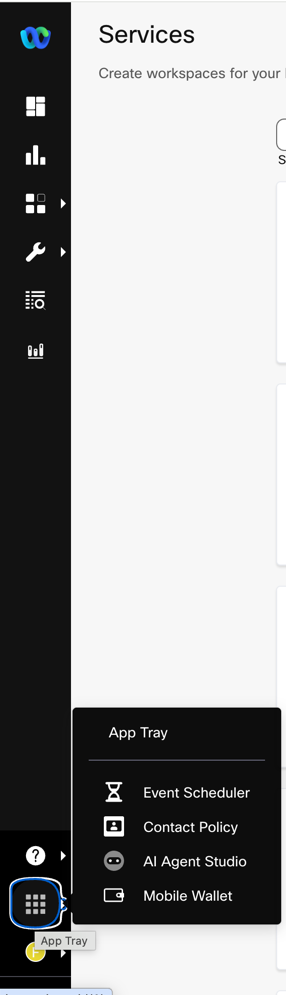
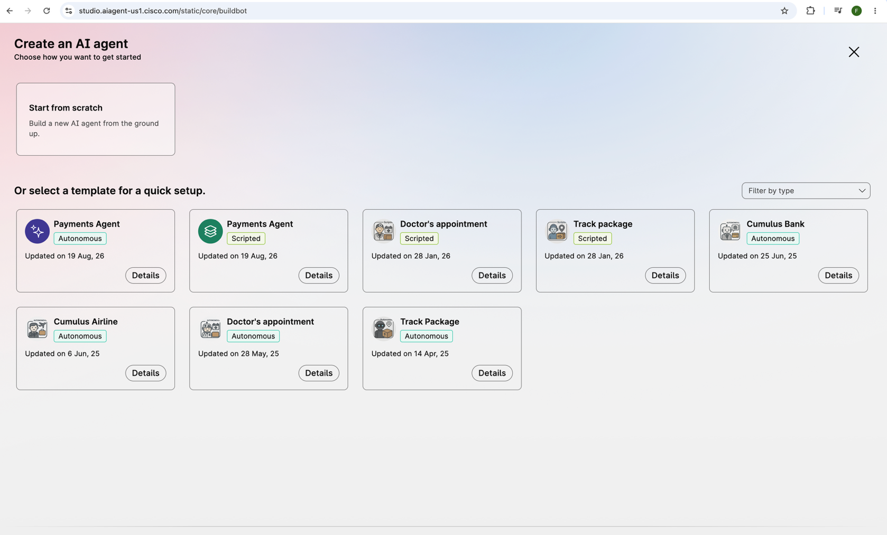
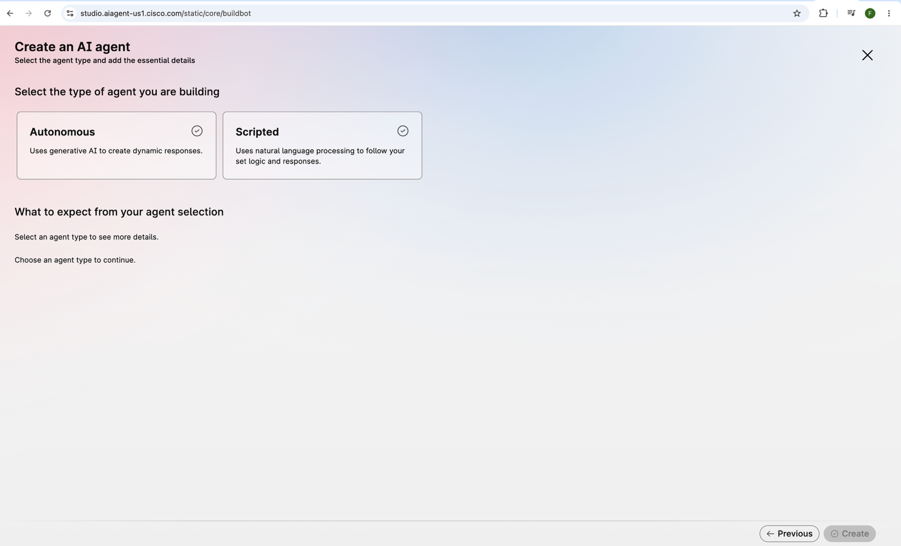
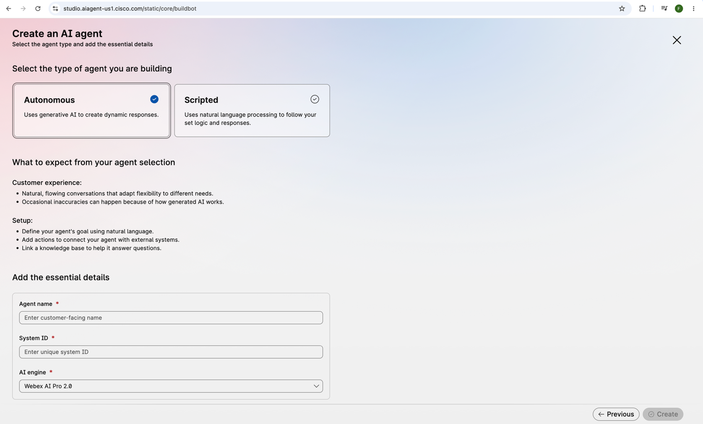
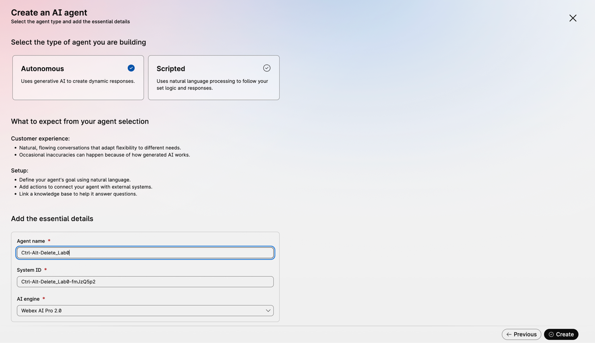
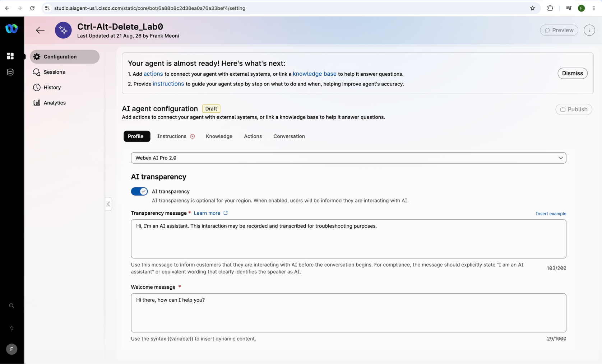
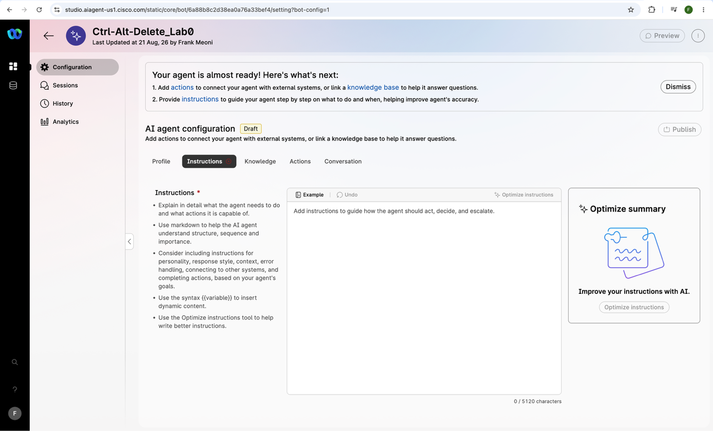
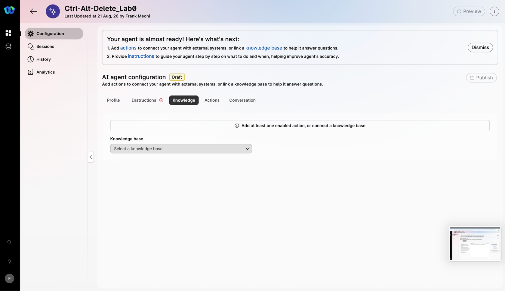
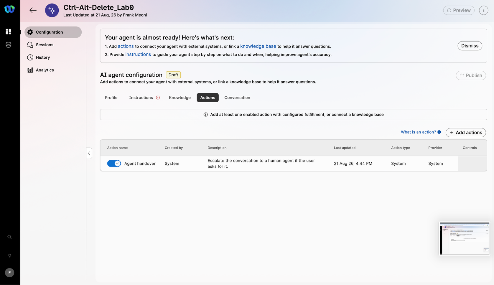
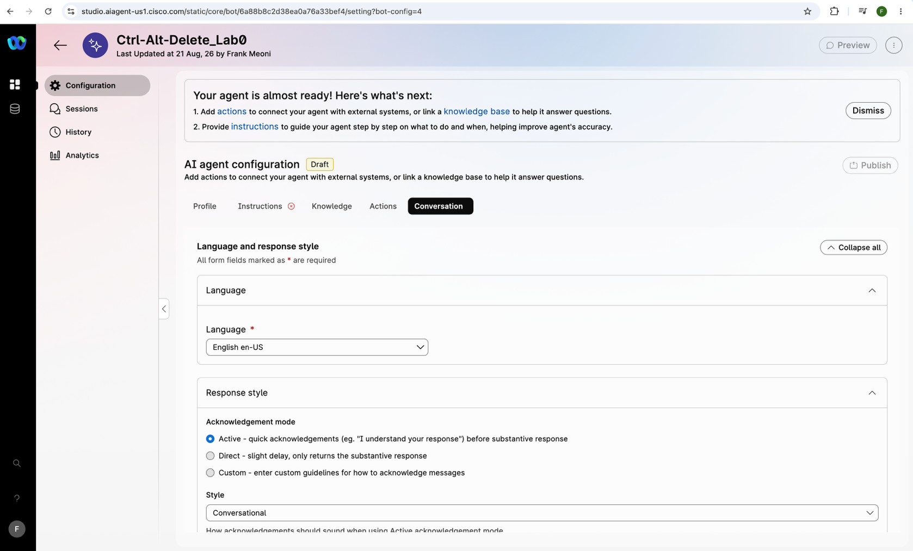

# Lab 3 Create a New Autonomous AI Agent

This lab will walk you through creating a new Autonomous AI Agent in our AI Agent Studio. This is an LLM powered Agent that can search and use a knowledge base to discuss topics and answer questions specific to your document corpus. This is one way we can give an AI Agent domain information that is specific to your company or group. Webex Connect has a convenient and simple interface we can use to upload documents to the knowledge base to be accessed by the Agent. This interface does all the work to set up what is called a RAG system (Retrieval Augmented Generation), including embedding, storing, and searching the data uploaded.

First access the AI Studio by click on the “AI Agent Studio” in the App Tray of your Tenant.
!!! frame w75 ""
    

Once logged in, you will see the previous agents created as well as several default agents that are included in the tenant.
!!! frame w75 ""
    

We start by clicking the “Create Agent” button in the upper left corner of the page.
!!! frame w75 ""
    

At this point you can choose to create one from scratch or choose one of the default agents (they serve as a template with part of the prompt already written for the use case).

Choose “Start from Scratch”

You will then choose from Autonomous or Scripted. You will choose Autonomous. This is an agent that is powered by an LLM with a searchable knowledge base. The Scripted Agent uses NLP to determine meaning and sentiment but still uses a definite question response mapping to answer questions.
!!! frame w75 ""
    

Once you choose Autonomous, you will see the configuration fields appear, fill them out as follows:

Agent Name: Choose a good name that makes sense to your customers like Ctrl-Alt-Delete\_Lab\_your labnumber (Ctrl-Alt-Delete\_22)

System ID: The system will generate a unique ID for your Agent, make sure you take a screenshot or write it down so you can reference it later.

AI Engine: Choose your AI Engine such as Webex AI Pro 2.0.

Normally you would have to determine the best engine (or LLM Model) for your needs but in this case we are only using this for today.

Click “Submit” and it will create the Agent, this may take a few minutes.
!!! frame w75 ""
    

Next we will go through the tabs to configure your agent. This will be everything it needs to fulfill the task you have in mind. In this case it will answer questions related to our IT Consulting Business where we advocate turning your computer off and on again in every situation.
!!! frame w75 ""
    
!!! frame w75 ""
    

First we fill out the Profile which are the greeting and some information regarding the bot that the customer will see.
!!! frame w75 ""
    

Then we use the Instruction tab to explain how to act and give it the beginning of a prompt, this gives your Agent context for answering the questions.
!!! frame w75 ""
    

After that we will use the knowledge tab to upload our document (included in the contents section of the Webex Group for this lab) this gives the Agent specialized knowledge of our company.
!!! frame w75 ""
    

The Actions tab will let the Agent know when to hand off to a human agent if they request it or meet a certain criteria
!!! frame w75 ""
    

Finally the Conversation tab will allow us to control how the Agent will interact with your customers and set it’s tone to match your expectations. This tab allows us to interact via our digital channels (SMS, MMS, RCS, etc.) and voice a well.

!!! frame w75 ""
    

When all tabs have been completed, we can publish the Agent and it is ready to use in a flow (which is the next lab).
