# Lab 4 Using the AI Agent in a Flow (SMS)

This lab will show you the power of our CPaaS platform and allow you to connect your new AI Agent to the SMS channel.

This is what the final Flow should look like when completely built out
!!! frame w75 ""
    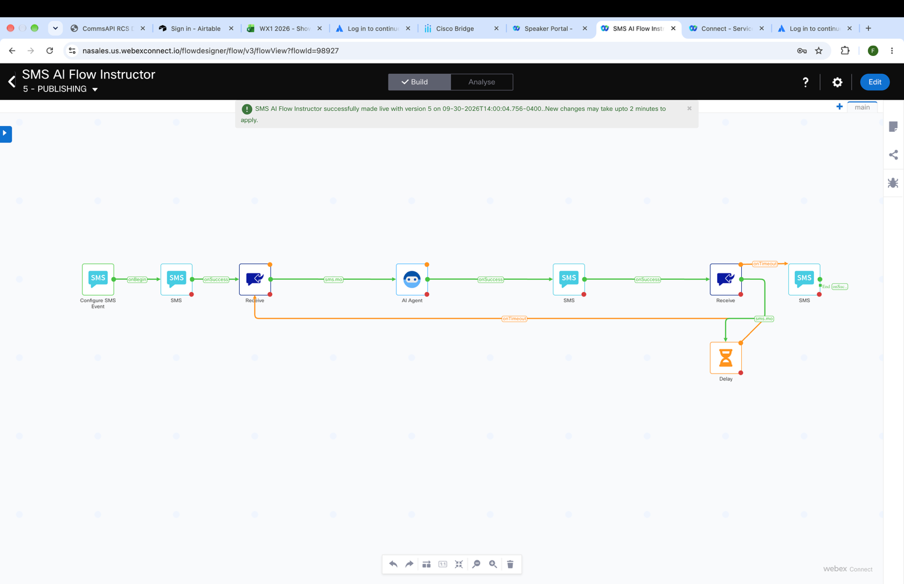

To start, go back to the Webex Connect Tenant, find your Student Service just like in the previous labs and double click to open it.

This process is exactly like the previous ones please reference [here](#Create_Flow_Process) for images if needed

Click on the “Flow Tab”

Then click on Create Flow

Give it a name like “SMS AI Flow Student {your student number}” Example “SMS AI Flow Student 01”

Click “Start from Scratch”

Choose “New Flow” in the method drop down

Then click “Create”

This opens the Flow Builder and gives you access to the Node Pallet

This flow will use SMS to create a method for communicating with the AI Agent you just created.

Start by choosing the trigger method, in this case SMS.

Configure the node as seen below using your student number as part of the KEYWORD (i.e. AIStudent01), click “Verify” and wait for the verified note. If you get an error, change the KEYWORD slightly and try again.
!!! frame w75 ""
    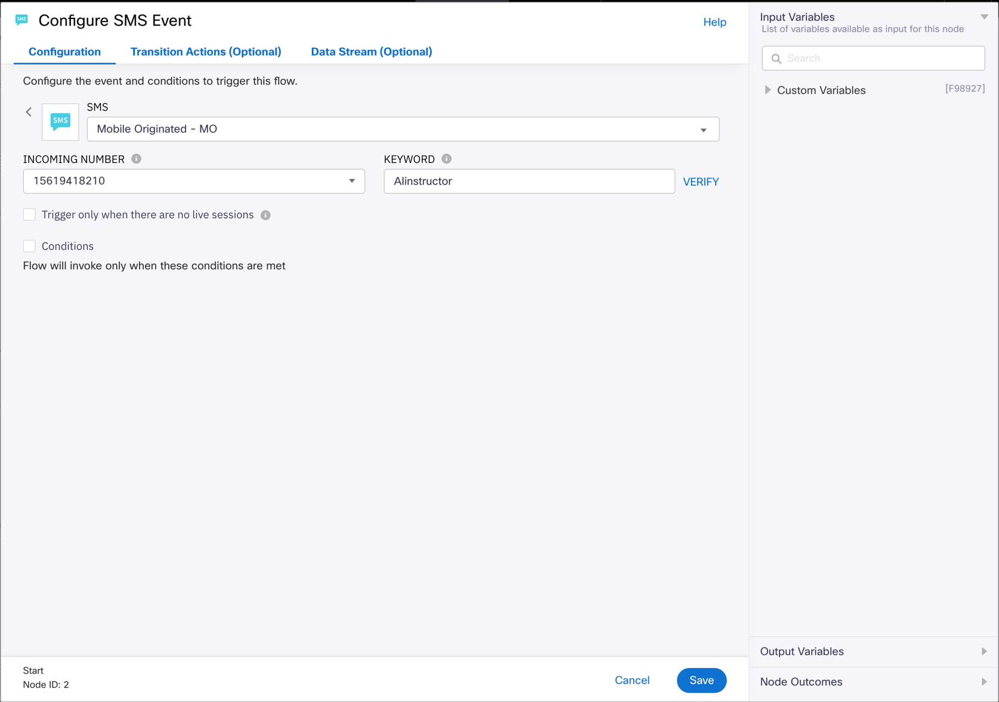

Click “Save”

Drag and drop an SMS Send Node into the canvas, connect it to the trigger node and configure as follows:
!!! frame w75 ""
    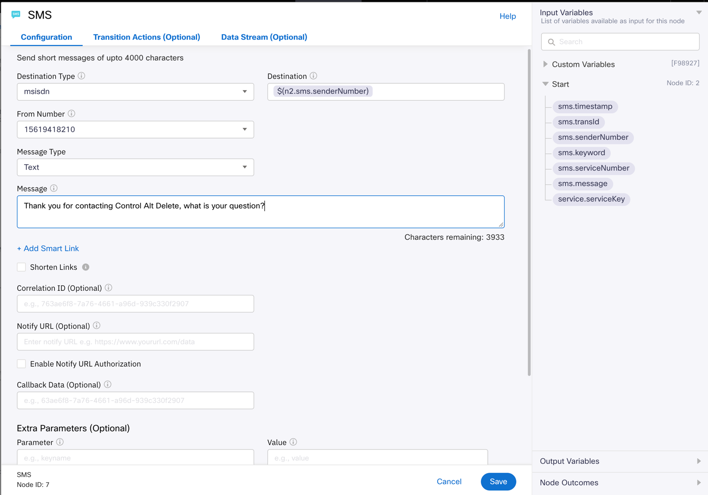

Next we will need a receive node to capture the question for the AI Agent, drag it onto the canvas, connect it to the SMS node above and configure it as follows.
!!! frame w75 ""
    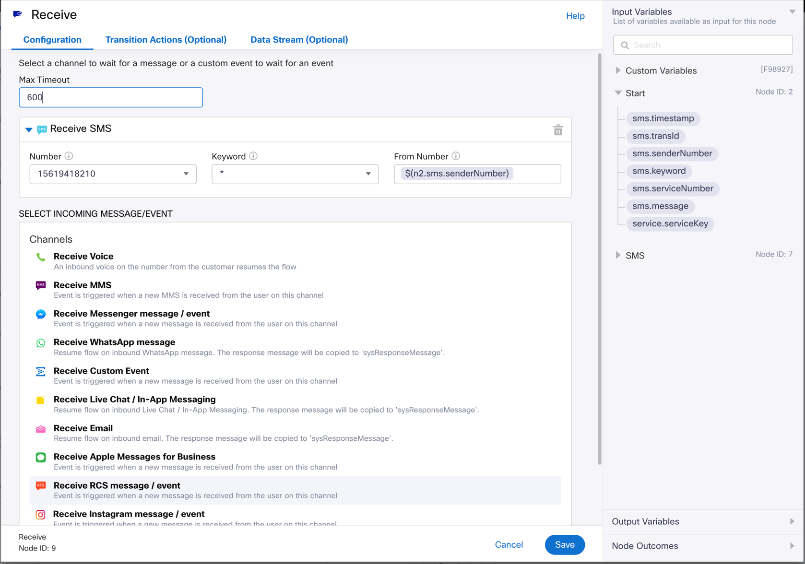

Then before clicking “Save” click on the Transition Action Tab at the top of the page and configure that as follows.
!!! frame w75 ""
    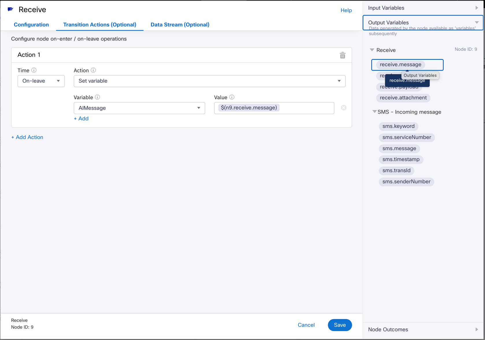

Click Save

Now for the engine that answers all your questions, you will next need to drag an AI Agent node onto the canvas and connect it to the Receive node. Configure it as follows except use YOUR AGENT YOU CREATED from the “AGENT” drop down.
!!! frame w75 ""
    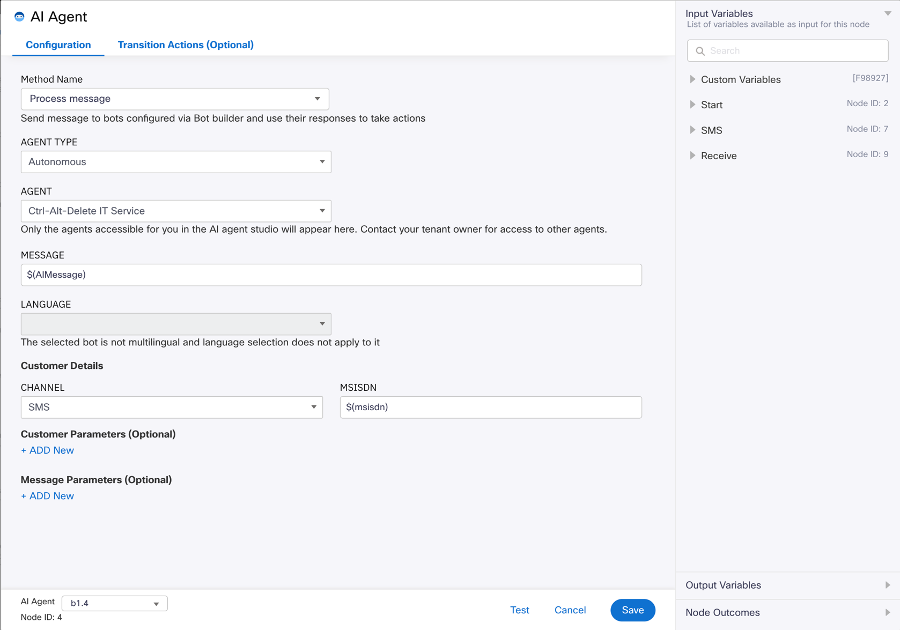

Click Save

The next node will deliver your AI Agent’s answer back to the user via SMS so drag and drop a new SMS Message Node onto the canvas, connect it to the AI Agent Node, and configure as follows.
!!! frame w75 ""
    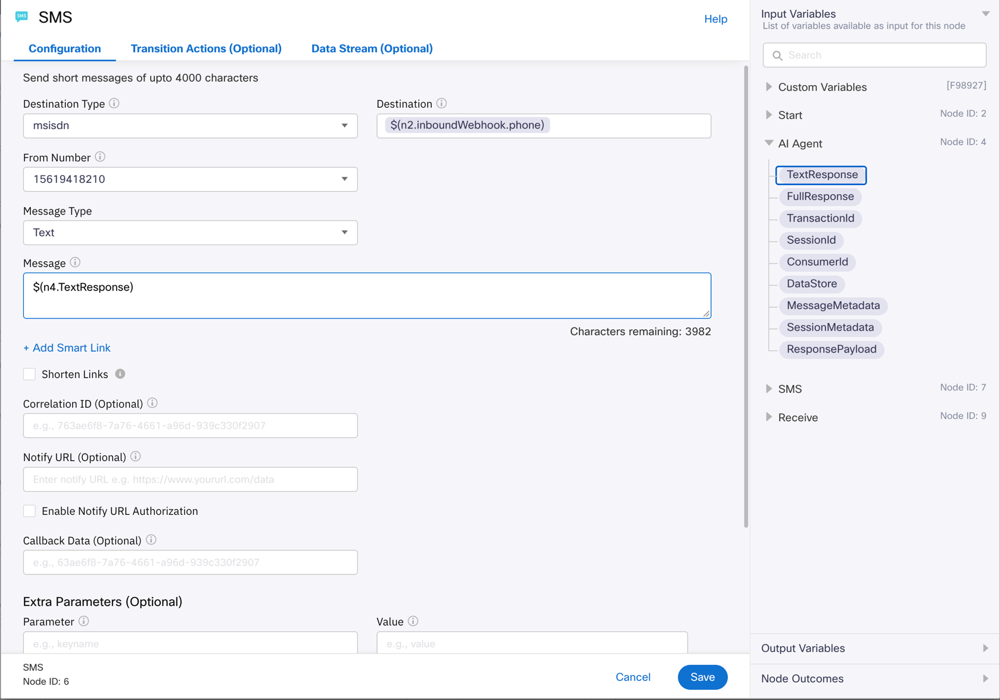

For this next part, we have to define whether or not the user is asking another question, in this case we can set up another receive node but set the timing to a minute then if no response comes, we end the conversation, otherwise we will loop the user back to the agent for another question.

Drag and drop a new Receive Node onto the canvas and connect it to the previous SMS Node, then configure as follows.
!!! frame w75 ""
    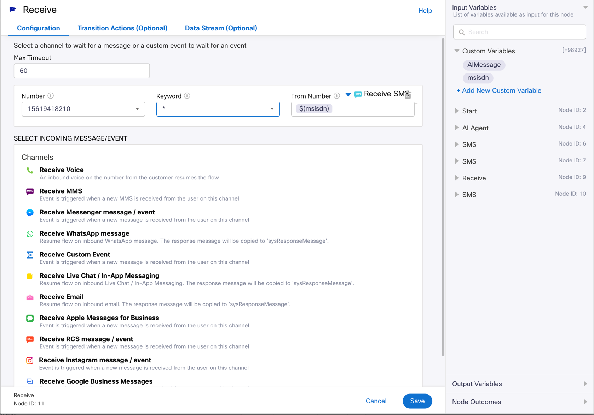

In the next step, we need will loop back to the AI Agent or end the conversation. Drag and drop a new SMS Message Node onto the canvas, then drag and drop a Delay Node onto the canvas. Connect the Timeout connector from the Receive Node to the SMS Message node (orange dot on the Receive Node). This routes a non-response (after a minute) to the “Goodbye” message. Then connect the green dot on the Receive Node to the Delay node and configure both nodes as follows.
!!! frame w75 ""
    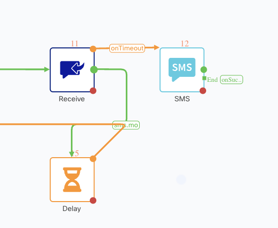

This is the SMS Node
!!! frame w75 ""
    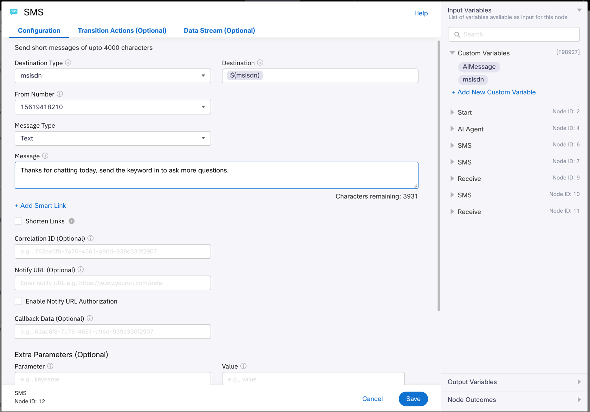

Click Save

This is the Delay Node
!!! frame w75 ""
    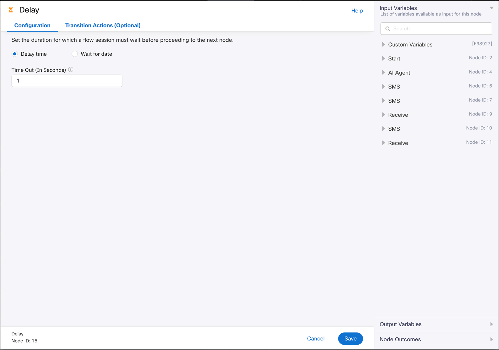

Click Save

Finally to finish this flow, we only need close the SMS Message “Goodbye” node by dragging the connector from the green dot on the SMS Message node to a blank space (not to another node) then configure as follows.
!!! frame w75 ""
    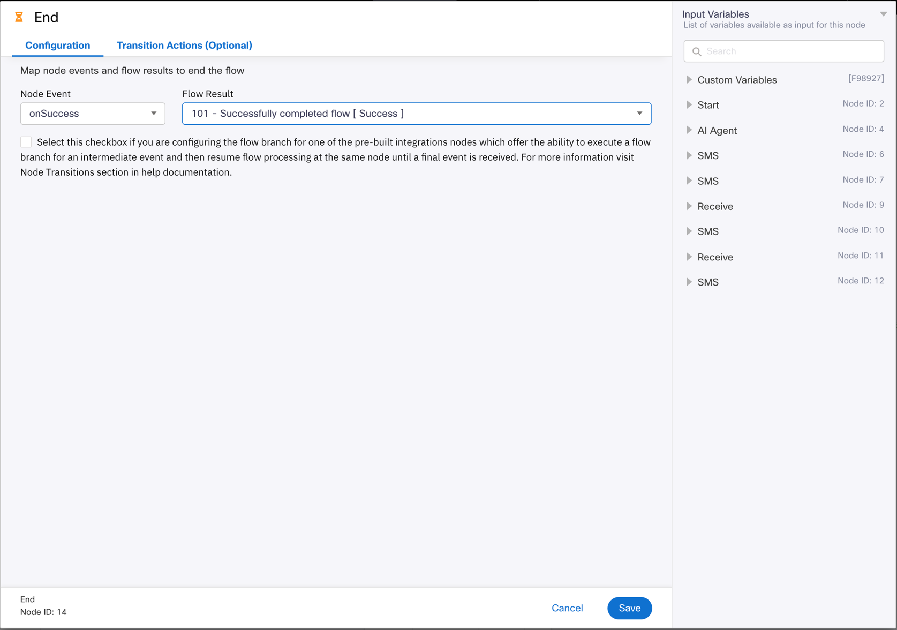

Then drag the Orange Dot (timeout) on the Delay Node back to the AI Agent Node.
!!! frame w75 ""
    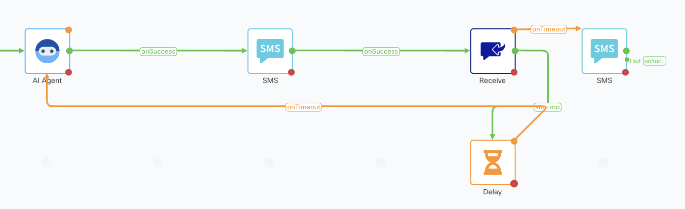
