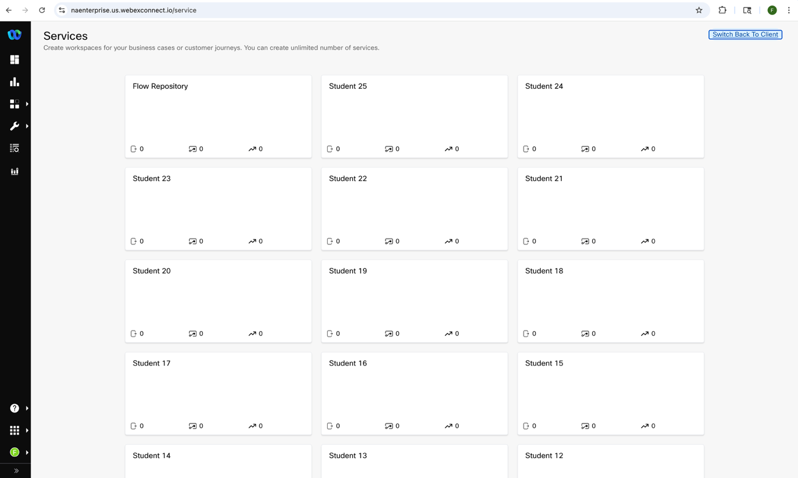
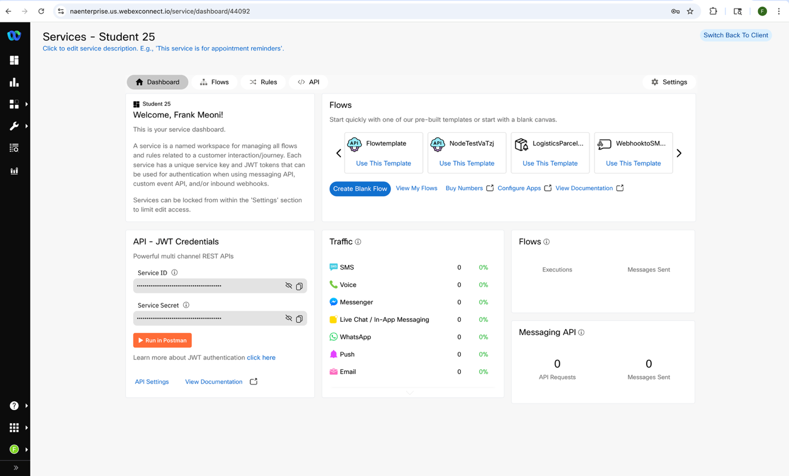
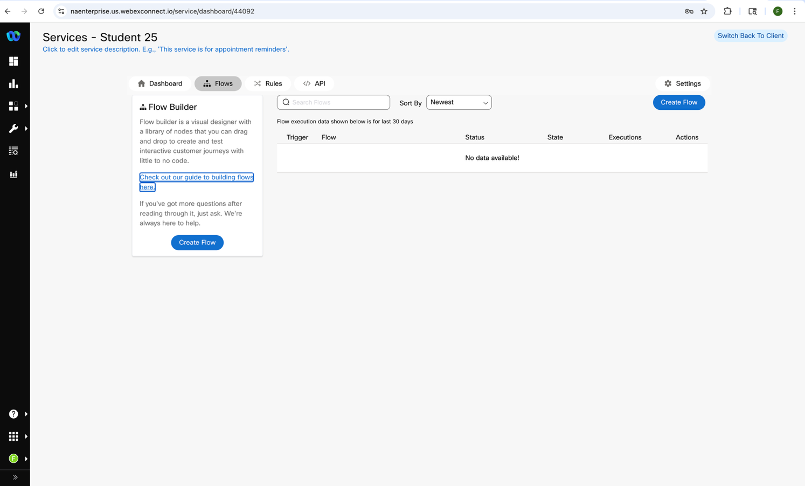

# Overview

This lab introduces creating intermediate to advanced flows in the Webex Connect CPaaS Platform. We will be creating and iterating on a flows that will showcase Rich Communication Channel functionality including Rich Cards and MMS. 

<!-- You will learn how to:

* Create a new flow from scratch
* Iterate add control logic
* Create flows using the RCS Channel including Rich Cards
* Insert business logic -->

---

# Requirements

You will need a **US Based Mobile Phone** to fully participate in this lab.  If you do not have a **US Based Mobile Phone** you can still build the flows, but you will not be able to test your flows.

---

# Getting started

## Let's Get Logged In
The labs will be split across two different tenants, with the first three exercises using these credentials.
> Launch [Webex Connect](https://naenterprise.us.webexconnect.io){:target="_blank"}  
> User Name: <copy><w class="nae_admin"></w></copy>  
> Password: <copy><w class="nae_pw"></w></copy>  
>
> ---

There are services already created as a place to complete the labs.
This is the list of Services that are set up in our Group and Team. Use your designated Student Number as a repository for your flows.
!!! frame w75 ""
      
 

Double Click to open your service. You will see the following screen:
!!! frame w75 ""
    
 
Feel free to take a minute to explore the Rules and API tabs, these are both used by the platform but will not be covered today.
We will be working in the Flows tab and when you open this tab, you should see “No data available!” only.
When we start our first lab, we will begin by clicking on the “Create Flow” button.
!!! frame w75 ""
    

